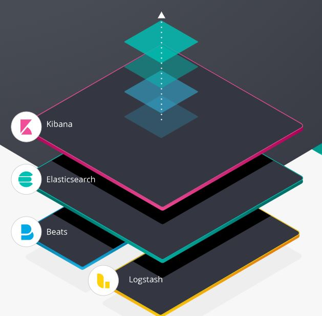
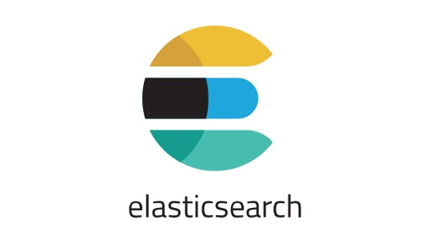
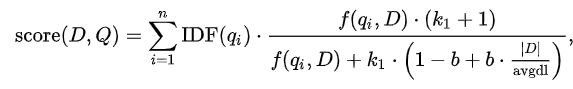
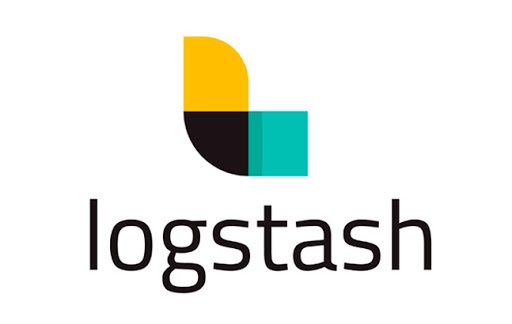
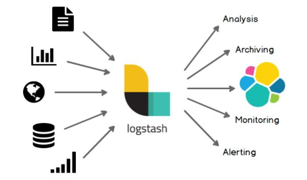
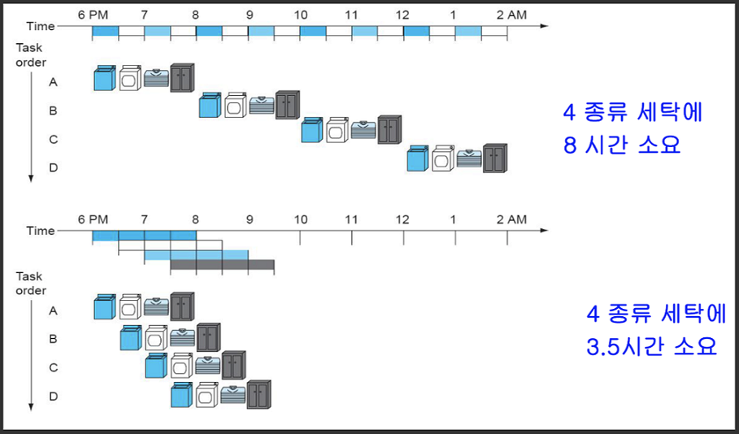
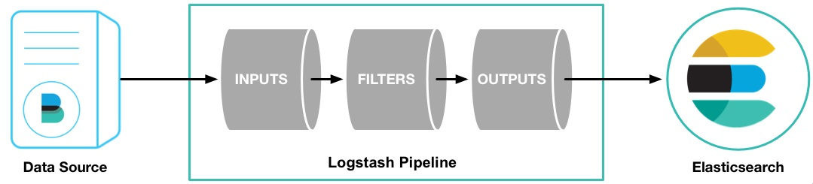
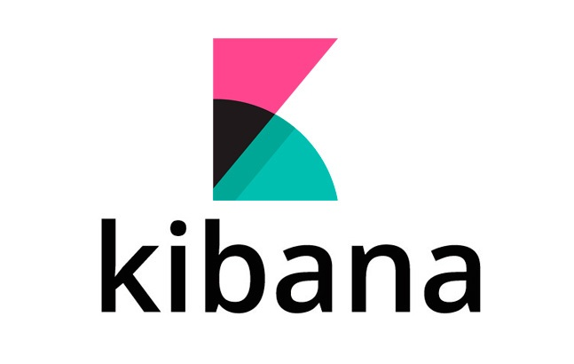
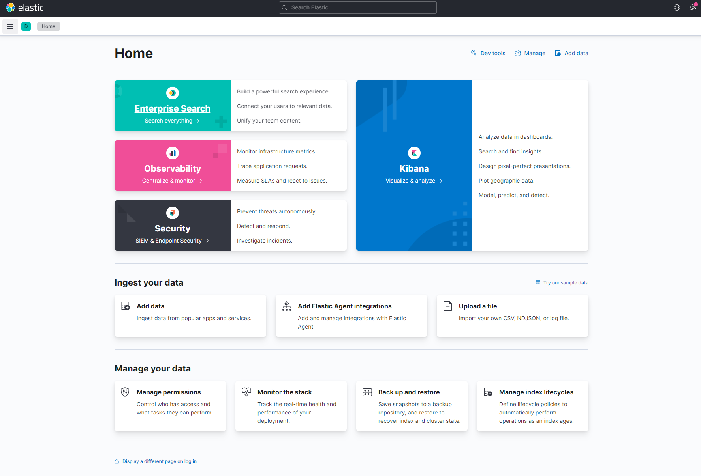

# ELK STACK (1) - ELK Stacks가 무엇인지 알아보자

---

### 목차

[1. ELK Stack](#1-elk-stack)

[2. Elastic Search](#2-elastic-search)

[3. Logstash](#3-logstash)

[4. Kibana](#4-kibana)

[5. Beats](#5-beats)

---

## 1. ELK Stack

----

오픈 소스 Elastic Search와 Logstash, Kibana, Beats를 합쳐 놓은 소프트웨어 연합체로, 이들의 이니셜을 따서 작명했다고 합니다.

아래 그림은 ELK의 구조를 나타낸 것인데, **파일에 접근** 할 수 있고, **데이터를 수집**할 수 있는 소프트웨어 **Beats**와 

**로그를 수집**하고 **데이터를 관리**하는 소프트웨어 **Logstash** 위에 

**검색**을 담당하는 모듈인 **Elastic Search**를 달고, 

이를 좀 더 쉽게 사용하기 위해 **UI/UX를 제공**하는 **Kibana**를 올려놓은 형태입니다. 

자세한 사항은 아래 항목에서 설명하도록 하겠습니다.

오픈 소스 홈페이지 https://www.elastic.co/kr/ 에 들어가시면, 좀 더 자세한 문서를 보실 수 있습니다.

---
  
## 2. Elastic Search

---

**Elastic Search.**

검색 엔진 중 하나입니다. 네이버나 구글같은 포털 사이트에서 볼 수 있는 검색창이라고 할 수 있습니다. 검색을 해서 사용자가 원하는 결과를 받아오는 것 뿐만 아니라, **연관 검색어**와 같이 사용자가 원하는 결과를 추측하는 알고리즘까지 제공합니다. 설치 과정과 사용 방법은 비교적 쉽고 간편하며, AWS와 같은 클라우드 서비스와 연동이 가능합니다.

----

### 검색 알고리즘

검색 알고리즘은 용도에 따라, [이진 탐색 알고리즘](https://ko.wikipedia.org/wiki/%EC%9D%B4%EC%A7%84_%EA%B2%80%EC%83%89_%EC%95%8C%EA%B3%A0%EB%A6%AC%EC%A6%98)과 [트라이 알고리즘](https://namu.wiki/w/%ED%8A%B8%EB%9D%BC%EC%9D%B4)을 비롯한 수많은 알고리즘이 존재합니다. 컴퓨터 공학 분야에서는 알고리즘 중에서도 Fundemental한 것으로 인정하고 있습니다. 

예를 들어, 우리가 다음과 같은 문장들(데이터)을 가지고 있다고 가정해봅시다.

>*"홍길동(허구의 인물, 서자)"
"홍길동은 아버지를 아버지라 부르지 못하고, 형은 형이라고 부르지 못한다."
"호형호제 : 아버지는 아버지라 부르고, 형은 형이라고 부른다는 말."
"조선시대에는 서자에 대한 차별이 있었습니다."
"한국에서는 인적 정보에 대한 예시로, 홍길동이라는 이름을 자주 사용한다. "*

누군가(사용자)가 우리에게 *"홍길동"*이라는 단어에 대해 설명해달라고 했을 때, "홍길동"이라는 단어를 정확히 포함하는 문장만을 알려주면, 간단하게 설명할 수 있습니다. 다음과 같은 문장으로 설명할 수 있습니다.

>*"홍길동(허구의 인물, 서자)"
"홍길동은 아버지를 아버지라 부르지 못하고, 형은 형이라고 부르지 못한다."
"한국에서는 인적 정보에 대한 예시로, 홍길동이라는 이름을 자주 사용한다. "*

사용자가 "아버지를 아버지라 부르지 못하고, 형은 형이라 부르지 못한다."라는 단어를 사자성어로 무엇이라 했던 것 같은데 하고 궁금해서  *"아버지를 아버지라 부르지 못하고 형은 형이라 부르지 못한다"* 라는 단어를 검색할 경우, **정확한 단어 일치**를 보는 위의 방식으로는 다음과 같은 결과만 알려줄 겁니다.
 
>*"홍길동은 아버지를 아버지라 부르지 못하고, 형은 형이라고 부르지 못한다."*

사용자가 원하는 대로, "호형호제"라는 단어를 꺼내기 위해서는, 키워드와 문장 간의 어떤 **연관도나, 비슷한 정도를 알아내는 알고리즘**이 필요해 보이지 않나요? 그것이 바로 **BM25 알고리즘** 입니다.

**Elastic Search**는 바로 이 BM25 알고리즘을 활용합니다.

[BM25의 원리](https://inyl.github.io/search_engine/2017/04/01/bm25.html)를 자세히 알아볼 필요까지는 없습니다. 굉장히 복잡하기 때문인데, 일단 BM25 스코어 수식부터가 아래와 같습니다.

----

### [검색 엔진](https://ko.wikipedia.org/wiki/%EA%B2%80%EC%83%89_%EC%97%94%EC%A7%84)
Elastic Search는 모든 종류의 문서를 검색하는데 사용할 수 있습니다. 우리가 보통 알고 있는 포털사이트에서 하는 검색 방식뿐만 아니라, 변수나 조건문을 넣어서 검색을 할 수도 있습니다. 예를 들어, 동물 병원에서 고객 목록에서 "백구"라는 검색 키워드로 검색하는 것 뿐만 아니라, "백구"와 "주인 이름이 홍길동"이라는 조건도 검색을 할 수 있는 것 입니다.

Elastic Search는 [루씬(Lucene)](https://ko.wikipedia.org/wiki/%EB%A3%A8%EC%94%AC)이라는 JAVA 로 작성한 라이브러리를 기반으로 만들었습니다. 루씬은 기본적으로 [역파일 색인(inverted file index)](https://ko.wikipedia.org/wiki/%EC%97%AD%EC%83%89%EC%9D%B8) 라는 구조로 데이터를 저장합니다. 간단히 말해서, 데이터베이스에서 1번에 어떤 데이터가 있고, 2번에 어떤 데이터가 있다에 대한 정보를, 어떤 데이터 베이스 파일에 1번 데이터와 2번 데이터가 있다라는 것을 기록한다는 것입니다. 이를 통해 전문 검색(Full Text Search)라는 기능을 할 수 있는 것입니다. 

검색 결과를 JSON 문서로써 제공합니다. JSON형식은 간결하고 개발자들이 다루기 편한 구조로 되어 있어 색인 할 대상 문서를 가공 하거나 다른 클라이언트 프로그램과 연동하기에 용이합니다.

또한 key-value 형식이 아닌 문서 기반으로 되어 있기에 복합적인 정보를 포함하는 형식의 문서를 있는 그대로 저장이 가능하며 사용자가 직관적으로 이해하고 사용할 수 있습니다. Elastic Search에서 쿼리에 사용되는 쿼리문과 쿼리에 대한 결과 모두 JSON 형식으로 주고 받습니다.

밸런싱(Valancing)과 라우팅(Routing)을 자동으로 제공하므로, 서버와 데이터 베이스 사이에서 적절한 조율자 역할을 해줍니다.

---

### 멀티 테넌시(Multitenancy)
Tenant라는 말은 "세입자"라는 말입니다. Multi-tenant는 "여러 세입자"라는 뜻이겠지요? 집은 하나인데, 들어가서 사는 세입자는 여러 명이라는 뜻입니다. 소프트웨어가 집이라고 하면, 세입자는 바로 사용자들이 되겠습니다. 집 하나에 세입자들이 자기들의 구역과 물건을 두면서 사용 권한을 나누는 것과 비슷합니다. 
엄밀히 말하면, 세입자들은 사용자 하나를 가르키지 않고, 특정 권한들을 공유하는 사용자 집단이 되겠습니다. 사용자 그룹 별로 전용 서버들을 만들지 않고, 구역만 나눠서 쓸 수 있도록 만드는 소프트웨어 아키텍처를 멀티 테넌시라고 합니다. **클라우딩 서비스**에서 핵심적인 기능으로 작용됩니다. 

Elastic Search의 데이터들은 인덱스(Index) 라는 논리적인 집합 단위로 구성되며 서로 다른 저장소에 분산되어 저장됩니다. 서로 다른 인덱스들을 **별도의 커넥션 없이 하나의 질의로 묶어서 검색**하고, 검색 결과들을 하나의 출력으로 도출할 수 있는데, Elastic Search의 이러한 특징을 멀티 테넌시 라고 합니다.

---

### Elastic Search를 이용하는 회사들
유명한 회사만 조금 가져왔습니다.
- Adobe
- GitHub
- Netflix
- Facebook
- FDA

## 3. Logstash

---

**Logstash.**

컴퓨터에서 기록을 남기는 행위인 로그(Log)와 따로 저장하다라는 뜻의 스테이시(Stash)를 합성한 이름으로 추측할 수 있듯이, 로그를 수집하고 처리하는 일을 하는 소프트웨어입니다.

조던 시셀(Jordan Sissel)에 의해 탄생된 Logstash는 원래 [Elastic Search](#1)와 별개로 다양한 데이터 수집과 저장을 위해 개발된 프로젝트였습니다. 검색 기능만 제공하던 Elastic Search에서는 자체로 데이터 수집을 할 수가 없었던 것 입니다. 그래서 Logstash와 Elastic Search가 연합하게 되었다고 합니다.

200개가 넘는 플러그인을 지원하며,새로 생성할 수도 있습니다.

Logstash는 JRuby로 되어 있습니다. 루비 코드로 개발되어 자바의 런타임 머신 위에서 돌아갑니다. 

Elastic Search와 마찬가지로 Apache 2.0 라이센스를 따르고 있어 자유롭게 사용이 가능합니다. 

### 파이프라이닝

Logstash를 접하게 되면 가장 먼저, 가장 많이 나오는 단어가 이 파이프라이닝(Pipelining)입니다. 컴퓨터 공학에서 보통 파이프라인을 다음과 같이 설명하곤 합니다.

일련의 작업을 병렬적으로 일정 시간대 안에 배분하여 처리하는 것을 파이프라이닝이라고 합니다.

Logstash의 파이프라인에 들어가는 작업들은 세 가지입니다. 각 작업에 대한 자세한 설명은 아래에서 진행하겠습니다. 

- 입력 : 다양한 데이터 저장소로부터 데이터를 입력
- 필터 : 데이터를 확장, 변경, 필터링 및 삭제 등의 처리를 통해 가공
- 출력 : 다양한 데이터 저장소로 데이터를 전송

---
### 입력
API를 사용하여, Logstash의 데이터를 가져옵니다. 데이터는 Database File이 될 수 있고, FileBeat를 통해 가져올 수도 있습니다. 이 때 가져오는 데이터는 Event로써 반환합니다.

---
### 필터
필터는 필요에 따라 사용하지 않을 수 있으며, 여러가지 형태로 데이터를 가공할 수 있습니다.

- grok : 구문 분석 및 임의의 텍스트로 구성합니다.

- mutate : 이벤트 필드에서 일반적인 변환을 수행합니다.

- drop : 이벤트를 삭제합니다.

- clone : 이벤트의 복사본을 만듭니다.

- geoip : ip 주소의 지리적 위치에 대한 정보를 추가합니다.

---
### 출력
출력의 형태도 여러 가지로 제공합니다.
- elasticsearch : 이벤트 데이터를 Elastic Search에 보냅니다.

- file : 디스크 파일에 씁니다.

- graphite : graphite에 전송합니다. (graphite : 메트릭을 저장하고 그래프로 작성하는데 사용되는 오픈 소스 도구)

- statsd : 카운터 및 타이머와 같은 통계르 수신하고 UDP를 통해 전송되며, 하나 이상의 플러그 가능한 백엔드 서비스에 집계를 보내는 서비스입니다.

---

### FileBeat와 비교

데이터 수집에 있어서는 FileBeat가 리소스를 덜 잡아 먹는다고 합니다. Logstash는 수많은 기능을 지원하기 때문에 다소 무거운 편이고, FileBeat가 좀 더 가볍다고 합니다. Logstash는 다양한 입/출력 방식을 제공하는 반면, FileBeat는 logstash, elasticsearch, kafka, redis로 제한적입니다.

*저희 프로젝트에서는 위 4가지 외에는 잘 쓰이지 않아 보여서, FileBeat를 쓰는 것이 더 적절해 보일지 모릅니다.*

---

### 그 외의 활용

Elastic Search외에도 다양한 경로의 출력이 가능하기 때문에 Elastic Search에 데이터를 색인하는 동시에 로컬 파일이나 아마존 AWS S3 저장소로 동시에 송출도 가능합니다. 그리고 Elasticsearch와 상관 없이 Redis의 데이터를 Kafka로 전송하는 경우 등과 같이 독자적으로 사용되기도 합니다.

---

## 4. Kibana

---

**Kibana**
라시드 칸(Rashid Khan)이 개발한 Elastic Search 시각화 도구입니다. 

키바나 빌드 성공 화면

Kibana는 Elasticsearch를 가장 쉽게 시각화 할 수 있는 도구입니다. 검색, 그리고 aggregation의 집계 기능을 이용해 Elasticsearch로 부터 문서, 집계 결과 등을 불러와 웹 도구로 시각화를 합니다. Discover, Visualize, Dashboard 3개의 기본 메뉴와 다양한 어플리케이션들로 구성되어 있고, 플러그인을 통해 App의 설치가 가능합니다.

---
### Discover
[Elastic Search](#2)를 활용하여 데이터를 검색하기 위한 메뉴입니다. 검색 창에 쿼리문을 넣으면 간편하게 검색하고 필터링 할 수 있습니다. 검색 결과는 원본 문서, 테이블 형태 등으로 확인할 수 있습니다. 타임 시리즈를 동반한 로그 데이터의 경우에는 히스토그램 그래프를 통해 표현할 수 있습니다.

---
### Visualize
집합 집계 기능을 통해 조회된 데이터의 통계를 **다양한 차트로 표현**할 수 있는 패널을 만드는 메뉴입니다. 여기서 만들어진 패널들을 조합해서 대시보드를 만듭니다.

---
### Dashboard
Visualize에서 만든 시각화 도구들을 조합해서 대시보드 화면을 만들고 저장과 불러오기를 할 수 있습니다. 조회 데이터들에 대한 필터링이 가능하고, URL을 통해,  공유하거나 Json 형태로 내보내기나 가져오기가 가능합니다.

----
### 그 외 기능
Elastic에서 제공하는 유료 플러그인인 X-Pack을 설치하게 되면 Monitoring 기능을 이용해서 Elasticsearch 클러스터 상태를 모니터링 하거나, Graph 모듈을 이용해서 관계도 분석이 가능하고, Reporting을 사용한 Kibana화면의 PDF 출력도 가능합니다.

---

## 5. Beats

---

**Beats**
Logstash를 경량화해서 쓸 수 있는 데이터 수집기입니다. FileBeats와 Logstash 비교는 [Logstash](#3)항목에서 서술하였습니다.

Beats는 구글에서 개발된 Go 언어로 개발되었습니다. Go는 매우 가볍고 바이너리 실행 파일로 컴파일 되는 언어라 라이브러리 종속성도 적습니다. 현재 Elastic 에서는 Packetbeat, Libbeat, Filebeat, Metricbeat, Winlogbeat, Auditbeat 등을 개발하여 배포하고 있으며 50가지 이상의 Beats들이 개발되고 있습니다.

---

### Beats의 종류

#### Libbeat

먼저 Beats 팀은 처음 개발한 PacketBeat 프로그램에서 Elasticsearch로 전송하는 부분 만을 따로 추출하여 일종의 공통 라이브러리로 만들었습니다. 특정한 데이터를 수집하는 부분만 코딩 하고 나면 데이터를 JSON 문서로 변환하고, 데이터가 유실되지 않게 관리하고, Elasticsearch로 전송하는 역할은 이 공통 라이브러리인 Libbeat이 담당하게 됩니다.

#### Packetbeat

가장 처음 존재했던 Beat이 바로 Packetbeat 입니다. 설치된 시스템에 유통되는 패킷들을 스니핑 해서 Elasticsearch에 로드하는 기능을 합니다.

#### Filebeat

사용자들이 가장 필요로 하는 기능은 파일의 내용을 수집하는 기능입니다. Web log 또는 machine log 등이 저장되는 파일 경로를 지정하기만 하면 Filebeat은 해당 경로에 적재되는 파일을 읽어들이며 새로운 내용이 추가될 때 마다 그 내용을 Elasticsearch로 색인합니다.

#### Metricbeat

Metricbeat은 실행시켜놓기만 하면 시스템에서 실행중인 프로세스들의 정보와 이 프로세스들이 소모중인 CPU, Memory 등에 대한 상태들을 수집해서 Elasticsearch에 적재하고 손쉽게 이것들을 모니터링 할 수 있는 시스템을 만들 수 있습니다.

#### Winlogbeat

Winlogbeat은 Microsoft Windows 기반 시스템에서 시스템에 적재되는 Windows event 들을 수집해 Elasticsearch로 색인하여 모니터링 할 수 있도록 합니다.

#### Auditbeat

Auditbeat은 리눅스 시스템의 사용자 접속과 실행 이벤트 로그들과 같은 감사 데이터를 수집합니다. 주로 시스템의 보안 분석을 할 때 사용됩니다.

#### Heartbeat

다른 Beats 들도 이름에서 손쉽게 어떤 역할을 하는지 짐작이 가능한데, Heartbeat은 Beats 의 종류이면서도 심장 박동과 동일한 단어이기 때문에 재미있습니다. 역시 이름에서 유추할 수 있듯이 Heartbeat은 다른 프로세스들의 가동 시간 등을 모니터링 합니다. ICMP, TCP, HTTP 프로토콜 등을 통해 Ping 명령으로 원격의 프로세스의 가동 여부를 확인하는데, 동작은 단순하지만 다양한 시스템을 동시에 모니터링 할 때 매우 유용합니다.

#### Functionbeat

가장 최근에 추가된 Functionbeat은 요즘 유행하는 마이크로 서비스 아키텍쳐(MSA)와 같은 FaaS 클라우드 기반의 시스템에서 서버리스 프레임워크를 이용하여 클라우드 인프라를 모니터링 합니다. 다른 Beats 들과 달리 수집을 위한 데이터가 있는 시스템에 설치되는 것이 아니라 Lamda와 같은 기능으로 배포됩니다.

Beats 역시 현재는 Elastic Stack에 맞는 로고로 다시 디자인 되었지만 처음 로고는 모니카가 디자인 했던 물고기 였습니다.

---

### 출처

ELK Stack 공식 홈페이지 : https://www.elastic.co/kr/what-is/elk-stack
김종민님 Elastic 가이드북 : https://esbook.kimjmin.net/
소영님 개발 블로그 : https://soyoung-new-challenge.tistory.com/99
허원철님 개발 블로그 : https://heowc.tistory.com/49
